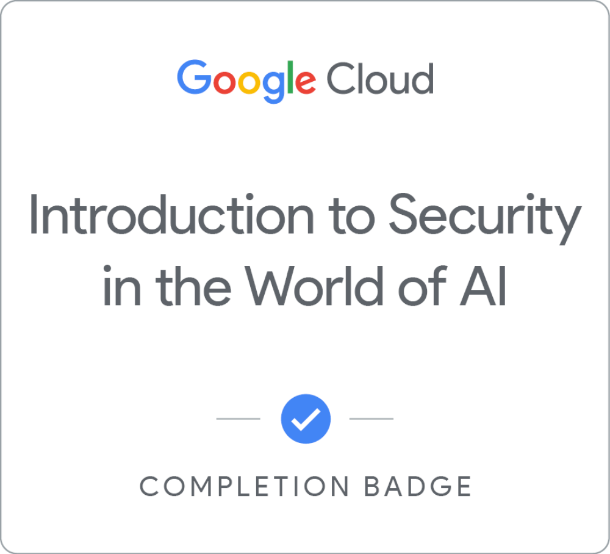

# Intro to AI Security (course notes)

Welcome to my learning repository for the **Introduction to Security in the World of AI** course. I am creating this repository to document what I learned about managing risks and safely deploying AI in an organization.

## 📌 Course Overview
* **Provider:** Google Cloud
* **Level:** Beginner / Leadership
* **Focus:** AI Security Strategy, Risk Mitigation, and Governance Frameworks

## 🧠 What I Learned 
This course is essentially a high-level outline for leadership and security teams on how to handle AI without breaking things or leaking data. It breaks down into four main areas:

### 1. The 4 Components of an AI System
You have to understand the moving parts to secure AI. The course breaks an AI app into four layers and each requires a different type of security focus:
* **Application:** The user interface or API. This is where you worry about end-user access controls and preventing bad inputs.
* **Data:** The fuel for the system. Securing this means making sure training data isn't poisoned, leaked, or violating privacy rules.
* **Model:** The actual brain or algorithm. This requires protection against unauthorized tuning, theft, or manipulation.
* **Infrastructure:** The backend hardware, cloud servers, and compute power running everything safely behind the scenes.

### 2. Spotting Risks Early
Instead of waiting for something to go wrong, security needs to be proactive. This means identifying AI-specific threats (like data vulnerabilities or model manipulation) before a tool ever goes live.

### 3. Google's Secure AI Framework (SAIF)
This was the most practical part of the course. SAIF is Google's framework for securing AI systems. My main takeaways from it are:
* **Use what you already have:** Don't build a separate security silo for AI. Integrate it into your existing security infrastructure.
* **Update threat detection:** Standard security tools won't catch AI-specific issues. You need to adjust your monitoring to look out for things like prompt exploits or bad data inputs.
* **Automate everything:** AI moves too fast for manual security reviews. Guardrails need to be automated right into the pipeline.

### 4. Industry Case Studies
We looked at how AI risks change across four different industries. A healthcare AI dealing with patient privacy requires totally different governance and compliance rules than a retail product recommendation bot. One size definitely does not fit all.

---

## 🎯 Skills Covered
* Spotting basic AI risk profiles.
* Working with Google's SAIF framework.
* Managing compliance and AI governance.

---

## ⚡ Connect
I'm using this space to track my ongoing learning in AI governance and cloud security. If you're working on similar projects or just want to chat about AI safety, feel free to connect!
